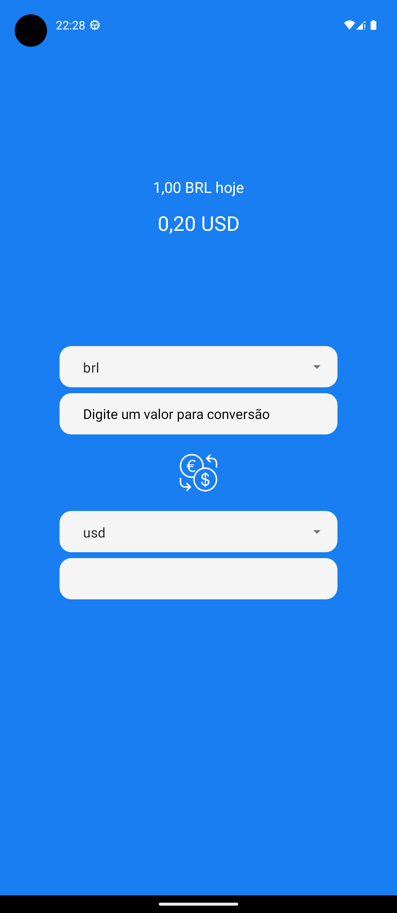
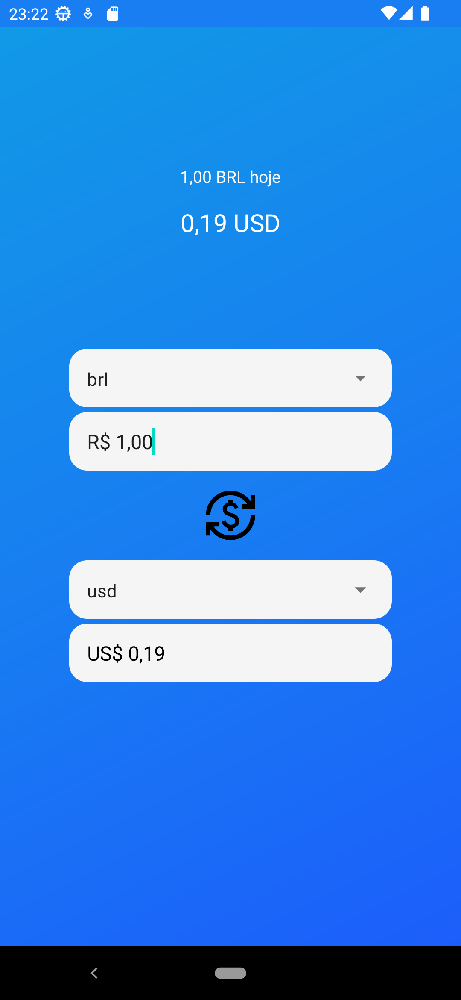
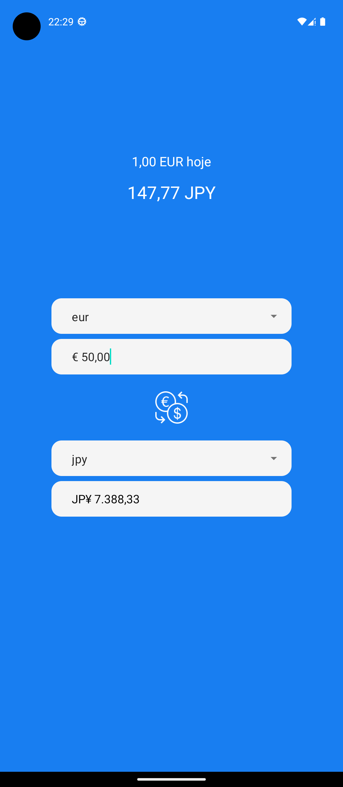
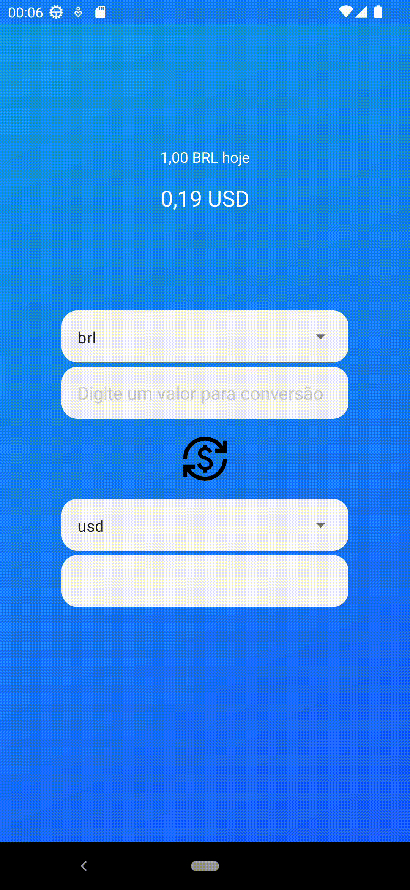

<h1 align="center">Conversor De Moedas</h1>

<p align="center">
  <a href="https://opensource.org/licenses/Apache-2.0"></a>
  <a href="https://android-arsenal.com/api?level=23"></a>
  <br>
  <a href="https://wa.me/+5571991154541"></a>
  <a href="https://https://www.linkedin.com/in/emerson-dos-santos-silva-398319206/"></a>
  <a href="mailto:emersonsantos1921@gmail.com"></a>
</p>

<p align="center">  

⭐ Esse é um projeto para demonstrar meu conhecimento técnico no desenvolvimento Android nativo com Kotlin. Mais informações técnicas abaixo.

Aplicativo que faz conversão de algumas moedas mais utilizadas com uma taxa de conversão recebida pela web, e com texto formatado com base nas moedas selecionadas.

</p>

</br>

<p float="left" align="center">



</p>

## Download
faça o download da <a href="apk/app-debug.apk?raw=true">APK diretamente</a>. Você pode ver <a href="https://www.google.com/search?q=como+instalar+um+apk+no+android">aqui</a> como instalar uma APK no seu aparelho android. 

## Tecnologias usadas e bibliotecas de código aberto

- Minimum SDK level 23
- [Linguagem Kotlin](https://kotlinlang.org/)

- Jetpack -
  - Lifecycle: Observe os ciclos de vida do Android e manipule os estados da interface do usuário após as alterações do ciclo de vida.
  - LiveData: Notifica as estruturas de Views quando há alterações nas informações da ViewModel.
  - ViewModel: Gerencia o detentor de dados relacionados à interface do usuário e o ciclo de vida. Permite que os dados sobrevivam a alterações de configuração, como rotações de tela.
  - DataBinding: Vincula dados observáveis a elementos da interface do usuário em seu layout declarativamente atráves do binding.
  - Custom Views: View customizadas feitas do zero usando XML.
  - [...]

- Arquitetura - 
  - MVVM (View - ViewModel - Model)
  - Comunicação da ViewModel com a View através de LiveData.
  - Comunicação da ViewModel com a Model através do repositório que executa as requisições Web.
  - Repositories para abstração da comunidação com a camada de dados.
  
- Bibliotecas - 
  - [Retrofit2 & OkHttp3](https://github.com/square/retrofit): Para realizar requisições seguindo o padrão HTTP.
  - [Google/Gson](https://github.com/google/gson): Para realizar a conversão da requisição no formato Gson.

## Arquitetura
**Conversor De Moedas** utiliza a arquitetura MVVM, o padrão de Repositories e Singleton, que segue as [recomendações oficiais do Google](https://developer.android.com/topic/architecture).
</br></br>

<br>

## API de terceiros

COLOQUE O NOME, LINK E DESCRIÇÃO DAS APIS UTILIZADAS NO PROJETO

## Features

### Feature 1


Texto de exemplo

### Feature 2


Texto de Exemplo.

# Licença

COLOQUE A LICENÇA - https://opensource.org/licenses

```xml

```
